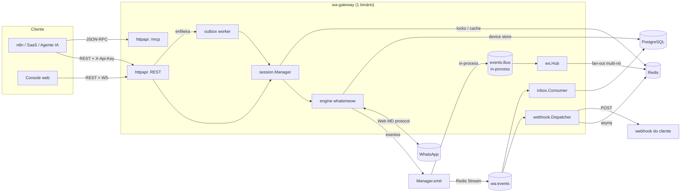
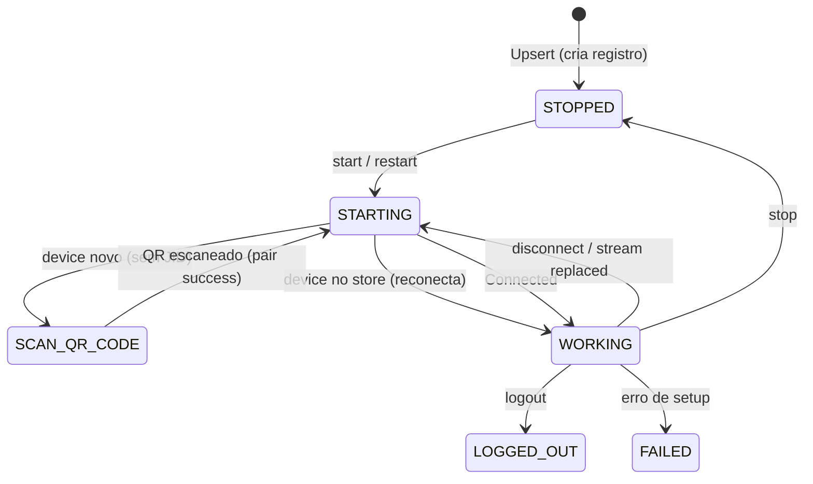
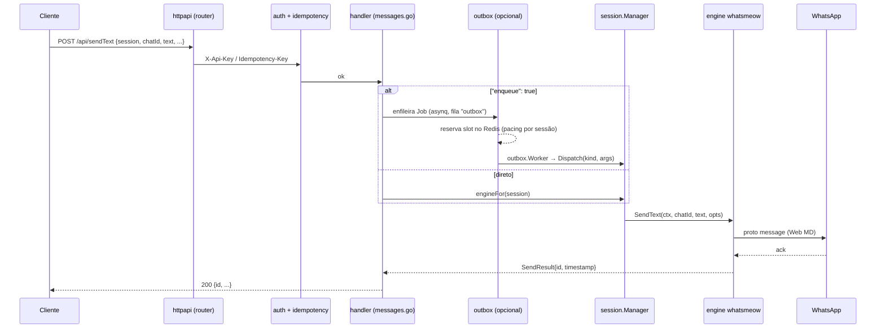
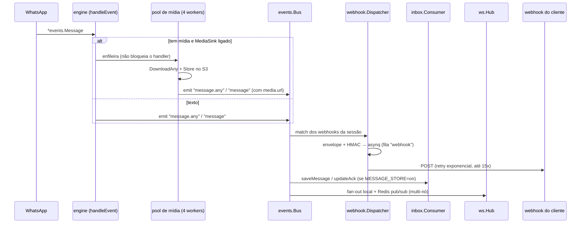

# wa-gateway — Arquitetura

Guia de quem mexe no código. Explica **o que cada peça faz**, **como um pedido
vira mensagem no WhatsApp** e **como uma mensagem recebida vira webhook**, o
modelo multi-nó, a referência de configuração e como estender sem quebrar nada.

> Escopo: reescrita enxuta em Go inspirada em Evolution API / WAHA. Não copia
> nomes nem padrões — a superfície REST *espelha* WAHA onde ajuda a migração.

---

## 1. Visão de 10 mil pés



**Fonte da verdade:** PostgreSQL. **Redis:** cache, locks de posse de sessão,
filas duráveis (asynq), **log durável de eventos** (Redis Stream `wa:events`),
pub/sub de WebSocket. **Um binário** — o console web é embutido via `//go:embed`.

---

## 2. Mapa de pacotes

| Pacote | Responsabilidade | Pontos de entrada |
|---|---|---|
| `cmd/wa-gateway` | *wiring* de tudo, ordem de boot, shutdown gracioso | `run()` |
| `internal/config` | lê env vars → `Config` | `config.Load()` |
| `internal/store` | acesso ao Postgres (pgxpool), migrations goose embarcadas | `store.New`, `store.Migrate` |
| `internal/cache` | cliente Redis: locks (Lua), cache JSON, pub/sub | `cache.New` |
| `internal/events` | barramento in-process com match por wildcard | `events.NewBus`, `Bus.Match*` |
| `internal/engine` | **interface** `Engine` + tipos de domínio + registry | `engine.Register`, `engine.Get` |
| `internal/engine/whatsmeow` | implementação sobre `go.mau.fi/whatsmeow` | `New` (registrada como `wa-gateway`) |
| `internal/session` | ciclo de vida: 1 engine viva por sessão, posse por lock | `session.Manager` |
| `internal/webhook` | monta envelope, assina (HMAC), entrega com retry via asynq | `Dispatcher.Run`, `Dispatcher.Handler` |
| `internal/inbox` | consome o barramento → persiste mensagens/chats/acks | `inbox.Consumer.Run` |
| `internal/outbox` | fila de saída com *pacing* anti-ban (slot por sessão no Redis) | `outbox.NewQueue`, `outbox.NewWorker` |
| `internal/ws` | WebSocket + fan-out de eventos entre nós via Redis pub/sub | `ws.NewHub`, `Hub.Run` |
| `internal/media` | armazenamento S3/MinIO opcional + `MediaSink` + coletor de TTL | `media.NewS3`, `media.NewSink` |
| `internal/httpapi` | REST, `/mcp`, `/openapi.json`, `/docs`, console SPA | `httpapi.NewRouter` |
| `internal/auth` | API key (chave-mestra + tabela `api_keys` com Argon2id) + middleware | `auth.New` |
| `internal/observability` | logger slog, métricas Prometheus | `NewLogger`, `metrics.go` |
| `migrations/` | SQL goose, embarcado com `//go:embed` | `0001…0008` |

### 2.1 A interface `Engine`

`internal/engine/engine.go` é o **contrato**. Todo o resto do sistema fala com
`engine.Engine`, nunca com o whatsmeow direto. Motor novo = nova implementação
+ `engine.Register`. Hoje há **dois**:

| Motor | Pacote | Protocolo | Seleção |
|---|---|---|---|
| `wa-gateway` (whatsmeow) | `internal/engine/whatsmeow` | WhatsApp Web multidevice | padrão |
| `cloud` | `internal/engine/cloud` | **Cloud API oficial da Meta** (Graph API) | `config.cloud` com `phoneNumberId`+`accessToken` |

O motor `cloud` implementa só o que a Cloud API oferece (envio incl.
**botões/lista/template**, recibos, mídia, perfil de negócio); o resto
devolve `engine.ErrNotSupported` → HTTP `501`. Não tem QR; os eventos chegam
por `GET/POST /api/{s}/cloud/webhook` (público, verificado por
`hub.verify_token` + `X-Hub-Signature-256`), que o engine parseia e injeta no
mesmo fluxo de eventos. Ver [CLOUD.md](CLOUD.md).

Grupos de métodos: envio (`SendText`, `SendImage`, `SendFile`, `SendVideo`,
`SendAudio`, `SendSticker`, `SendLocation`, `SendContact`, `SendPoll`,
`Forward`), operações sobre mensagens (`SendReaction`, `DeleteMessage`,
`EditMessage`, `MarkRead`, `SendChatPresence`), consultas (`CheckOnWhatsApp`,
`GetUserInfo`, `GetProfilePicture`, `Contacts`, `DownloadMedia`), conta/perfil
(`PairPhone`, `Me`, `SetStatusMessage`, `SetPresence`, `SetBlocked`,
`Blocklist`) e grupos (CRUD + participantes + foto/announce/locked + invite
link).

`engine.Deps` é o que o `Manager` injeta em cada engine: `Session`, `DSN`,
`Logger`, `Emit` (callback pro barramento), `Media` (o `MediaSink`),
`RawEvents func() bool`, `Behavior func() AutoBehavior` (auto-read / auto-online),
`StoredJID`, `Recovering`.

---

## 3. Ciclo de vida de uma sessão



- **`session.Manager`** guarda `running map[string]*handle`. Cada `handle` tem a
  engine viva, um `stopCh` e o `jid` pareado (pra detectar colisão).
- **Posse:** ao `start`, adquire um lock no Redis (`wa:lock:<sessão>`, TTL 30s,
  renovado a cada 10s). Só um nó tem a sessão viva por vez.
- **`pickDevice`** (whatsmeow): o `sqlstore` guarda os devices de **todas** as
  sessões na mesma tabela. Seleciona o device desta sessão casando pelo número
  (`User` do JID). Sem JID e em retomada de boot (`Recovering`): adota o único
  device do store, se houver — recupera órfão de pareamento interrompido.
- **`RestoreOwned`** roda no boot: reconecta em paralelo (limite 8) toda sessão
  cujo status era `WORKING` / `STARTING` / `SCAN_QR_CODE`.
- **`StopAll`** (shutdown): solta locks e desconecta **sem** marcar como parada
  — assim `RestoreOwned` reconecta no próximo boot.
- Ao parear (`pumpQR` "success") o status já sai de `SCAN_QR_CODE` e o
  `session.status` emitido faz o `Manager` **persistir o `sessions.jid` na
  hora** (não espera o `Connected`).

`sessions.config` (JSONB) é editável por API — ver [§7](#7-referência-de-configuração).

---

## 4. Enviar uma mensagem (request → WhatsApp)



- **`engineFor`** (`api.go`) resolve a engine viva **neste nó**. Se não existe:
  404 `not_found` (sessão inexistente) ou 409 `not_active` (existe, parada — com
  o status atual + dica de dar start).
- **`Idempotency-Key`** (header em POST) → resposta cacheada no Redis por 10 min.
- **outbox** (`"enqueue": true` ou `config.outbox`): a fila `asynq` reserva um
  *slot* por sessão via Lua (intervalo mínimo + jitter + teto diário) antes de
  soltar o envio. É *pacing* (reserva de slot), não rate-limit-com-retry.
- **`outbox.Dispatch`** mapeia `Kind` → método da engine. Kinds: `text`, `image`,
  `file`, `video`, `audio`, `sticker`, `location`, `contact`, `poll`, `forward`,
  `reaction`, `delete`, `edit`.
- **Campanhas** (`internal/campaign`): `POST /api/{s}/campaign` grava
  `campaigns` + `campaign_targets` (migração 0008) e o `campaign.Runner`
  enfileira **um job da outbox por alvo** (id `camp:<id>:<n>`) — o pacing, o
  retry e o registro são os do envio avulso. O progresso é um agregado sobre
  `campaign_targets`, alimentado pelo mesmo `OutboxRecorder` (que detecta o
  prefixo `camp:`). `POST /api/campaigns/{id}/stop` seta `status='stopped'`;
  o `Worker.gate` barra os jobs ainda não entregues. `Runner.Resume` (boot)
  retoma campanhas `running`, re-enfileirando só os alvos `pending` (o
  `TaskID` idempotente ignora os já enfileirados). Lock `wa:campaign:<id>`
  garante 1 runner por campanha no cluster. `GET /api/campaigns[/{id}]`.

---

## 5. Receber uma mensagem (WhatsApp → webhook / WS / DB)



- **`handleEvent`** (engine): `*events.Message` e `*events.Receipt` saem
  **achatados/normalizados** (`message.go`); qualquer outro evento passa por
  `translate()` → nome canônico `dominio.acao` (ex.: `group.update`,
  `call.received`) e, sem mapa, `engine.<tipo>` — **cobertura total**.
- Nomes de evento pro cliente: `message` (só recebidas, não `fromMe`),
  `message.any` (tudo), `message.ack` (delivered/read/played), `session.status`,
  `session.qr`, etc.
- **Mídia é assíncrona:** um pool de 4 workers tira o `DownloadAny`+`Store` do
  caminho crítico do handler do whatsmeow (rajada de mídia não atrasa os textos).
- **Dois caminhos de evento** (`Manager.emit` escreve nos dois):
  - **`events.Bus`** (in-process): publish sem lock (snapshot atômico).
    Best-effort — canal cheio descarta (contador `BusDropped`). Só o **WS**
    usa; perder um frame de WS é aceitável.
  - **`events.Stream`** (Redis Stream `wa:events`, `MAXLEN ~100k`): log
    durável. `Append` enfileira num buffer e um goroutine faz `XADD`.
    **webhook** e **inbox** consomem via `Consume` (consumer group + `XACK`
    só no sucesso + `XAUTOCLAIM` de pendências >60s). Efeitos:
    - crash no meio de um dispatch → o evento fica pendente → reprocessado
      (por este nó ou por outro do mesmo grupo);
    - **cada evento processado uma vez pelo cluster** (o group distribui);
    - webhook: `deliveryID = eventID|sha1(url)` = TaskID do asynq →
      reprocessar não duplica entrega;
    - inbox: `SaveMessage` falhou → evento pendente → retry (o payload
      já round-trip por JSON; `bytesOf`/`i64` lidam com isso).
- **`webhook.Dispatcher`**: consumidor do stream (grupo `webhook`, até 8 em
  paralelo), cache de config por sessão (TTL 5s), dedupe de entrega por URL.
  Cada webhook vira uma task asynq (`TaskID = deliveryID`, retry exponencial,
  HMAC `X-Webhook-Signature: sha256=<hmac>`, headers `X-Webhook-Id` = evento /
  `X-Delivery-Id` = evento+URL). O payload fica em `webhook_deliveries.payload`
  → `POST /api/deliveries/{id}/retry` reenfileira. Esgotou as tentativas →
  emite `webhook.exhausted` no stream (dead-letter observável; o próprio
  webhook pode assiná-lo).
- **Idempotência de entrega:** para mensagens/recibos, o `Event.ID` é
  **derivado do message-id do WhatsApp** (não aleatório). Logo `message` e
  `message.any` da mesma mensagem, e qualquer **re-entrega do WhatsApp**
  (sync ao reconectar), viram o mesmo `deliveryID` = mesmo `TaskID` do asynq
  → uma entrega só. Reforço: se a linha em `webhook_deliveries` já existe e
  está `delivered`, o dispatcher nem reenfileira.
- **`inbox`**: consumidor do stream (grupo `inbox`, `message.*`, até 4 em
  paralelo) → `store.SaveMessage` / `SaveChat` / `UpdateAck`. Extrai
  `mediaMeta` (directPath/mediaKey/sha…) pra permitir download posterior.

---

## 6. Modelo multi-nó (Fase 3)

- **Posse por lock (Redis):** cada sessão viva num nó só. `start` num nó que não
  tem a sessão e cujo lock está com outro → `ErrLocked`.
- **Eventos:** todo nó escreve no mesmo Redis Stream `wa:events`. Os grupos
  `webhook` / `inbox` distribuem o processamento entre os nós — cada evento
  cai em **um** nó, e se esse nó morre no meio, outro reclama a pendência.
- **WebSocket:** `ws.Hub` publica cada evento local no canal Redis `wa:ws`
  (frame `nodeID\x00json`); os outros nós recebem e entregam aos clientes WS
  locais. Pula o próprio nó. **Só publica se houver >1 nó vivo** — cada nó faz
  heartbeat num sorted set `wa:ws:nodes` (a cada 8s, TTL 25s); com 1 réplica o
  tráfego pub/sub é zero.
- **Roteamento de request entre nós** (`clusterProxyMW`, opcional): com
  `NODE_ADVERTISE_URL` setado, cada nó publica seu endereço no Redis
  (`wa:node:addr:<id>`, TTL 30s, heartbeat 10s). Um request para uma sessão
  que não está viva localmente é **encaminhado** (reverse-proxy) para o nó
  dono — resolvido via `wa:lock:<sessão>` (guarda o `nodeID`). Header
  `X-WA-Forwarded: 1` corta loop. Sem `NODE_ADVERTISE_URL` o middleware é um
  passa-direto (1 `if`). O nome da sessão sai do path param, da query
  `?session=` ou do corpo JSON (`{"session": …}` — com buffer+restore).
  `/ws` é isento (o `Hub` já faz fan-out entre nós).
- `GET /api/cluster` — nó atual, `routingEnabled`, nós vivos, sessões locais.

---

## 7. Referência de configuração

Tudo por env var. Padrões entre `()`.

| Var | Efeito |
|---|---|
| `HTTP_ADDR` (`:3000`) | endereço de escuta |
| `PUBLIC_URL` (`http://localhost:3000`) | base pública (links em respostas) |
| `DATABASE_URL` | Postgres (obrigatório) |
| `DATABASE_MAX_CONNS` (`0`→auto, mín 10) | pool pgx |
| `REDIS_URL` (`redis://localhost:6379/0`) | Redis |
| `API_KEY` | chave-mestra (escopo `*`). Vazia = só chaves da tabela `api_keys` |
| `SECRET_KEY` | 64 hex (32 bytes). Liga AES-256-GCM nos secrets de webhook em repouso. Vazio = texto puro. `openssl rand -hex 32` |
| `DEFAULT_ENGINE` (`wa-gateway`) | engine das sessões novas |
| `WEBHOOK_TIMEOUT` (`15s`) / `WEBHOOK_MAX_ATTEMPTS` (`15`) | entrega de webhook |
| `SESSION_UNHEALTHY_AFTER` (`2m`) | sessão viva fora de `WORKING` por mais que isso → evento `session.unhealthy` (+ `session.healthy` ao recuperar). `0` desliga |
| `OUTBOX_MIN_INTERVAL` (`3s`) / `OUTBOX_JITTER` (`2s`) / `OUTBOX_DAILY_LIMIT` (`0`=∞) | pacing global da fila de saída |
| `MESSAGE_STORE` (`on`) | persistir mensagens/chats. `off` desliga o `inbox` |
| `MEDIA_BACKEND` (`none` / `s3`) | ingestão de mídia |
| `MEDIA_TTL` (`0`) | apaga a mídia guardada N depois (0 = pra sempre). Override: `config.media.ttl` |
| `MEDIA_GC_INTERVAL` (`5m`) | varredura do coletor de mídia vencida |
| `MEDIA_ENRICH` (`false`) | transcreve áudio (`transcript`) e descreve imagem (`imageCaption`) no payload do evento. Override: `config.media.enrich`. Precisa de `AI_API_KEY` |
| `AI_BASE_URL` (`https://api.openai.com/v1`) `AI_API_KEY` `AI_TRANSCRIBE_MODEL` (`whisper-1`) `AI_VISION_MODEL` (`gpt-4o-mini`) | API compatível com OpenAI p/ o enriquecimento |
| `S3_ENDPOINT` `S3_REGION` `S3_BUCKET` `S3_ACCESS_KEY` `S3_SECRET_KEY` `S3_USE_SSL` `S3_PATH_STYLE` `S3_PUBLIC_BASE_URL` | config S3/MinIO |
| `CORS_ORIGINS` (CSV) | libera origens no browser |
| `ACCESS_LOG` (`false`) | log de acesso HTTP |
| `RATE_LIMIT_RPS` (`20`) / `RATE_LIMIT_BURST` (`0`→2×RPS, mín 10) | token bucket por chave de API (Redis). `0` desliga. Chave-mestra isenta. `429` + `Retry-After` |
| `LOG_LEVEL` (`info`) / `LOG_FORMAT` (`text`/`json`) | logger |
| `NODE_ID` | id do nó (multi-nó); vazio = `hostname-pid` |
| `NODE_ADVERTISE_URL` | URL HTTP deste nó p/ os outros. Setado = liga roteamento de request entre nós. Vazio = off |

Falha de S3 no boot **não derruba** o app: degrada pra "sem mídia" e loga.

### `sessions.config` (JSONB, por sessão)

```jsonc
{
  "metadata": { "time": "vendas" },
  "webhooks": [
    { "url": "https://…", "events": ["message", "session.status"],
      "hmac": { "secret": "…" },
      "retries": { "attempts": 10, "backoff": "5s" },
      "headers": { "X-Extra": "1" } }
  ],
  "outbox": { "minIntervalMs": 4000, "jitterMs": 2000, "dailyLimit": 500 },
  "media": { "store": true, "ttl": "168h", "enrich": true },  // store:false = não guarda; ttl "0" = nunca apaga; enrich sobrescreve MEDIA_ENRICH
  "cloud": { "phoneNumberId": "…", "accessToken": "…" }, // usa o motor Cloud API
  "rawEvents": false,   // inclui o struct cru do whatsmeow em payload.raw
  "autoRead": false,    // marca recebidas como lidas (recibo azul)
  "autoOnline": false   // mantém presença "available" após conectar
}
```

O coletor de mídia (`media.Sink.RunGC`, a cada `MEDIA_GC_INTERVAL`) apaga do
S3 **e** do Postgres tudo com `expires_at < now()`. `expires_at` é gravado no
insert a partir do `ttl` efetivo (sessão ou `MEDIA_TTL`). Apagar na mão:
`DELETE /api/media/{id}` ou `POST /api/{s}/media/purge {olderThan?}`.

`events` aceita wildcard: `message.*`, `*`. Cache de 10s no `Manager`
(invalidado no `Upsert`).

---

## 8. Autenticação & escopos

- Token via `X-Api-Key`, `Authorization: Bearer …` ou `?api_key=` (para `/ws`).
- **Chave-mestra** (`API_KEY`) → `Principal{Scopes: ["*"]}`. Isenta de rate limit.
- **Tabela `api_keys`**: hash Argon2id, `scopes text[]`, `revoked_at`.
  `Principal.Can(scope)` = `*` ou match exato. Rotas de admin usam `canAdmin`.
- **Escopo por sessão** (`sessionScopeMW`): uma chave com `scopes` como
  `["session:vendas", "session:suporte"]` só opera essas sessões — o
  middleware pega o nome da sessão (path/query/corpo, via `sessionFromRequest`)
  e 403 `forbidden_session` se `!CanSession(nome)`. `*` e `session:*` passam
  livres. Chave escopada: `GET /api/sessions` filtra pras dela, `POST
  /api/sessions` (criar) é barrado, `/ws` exige `?session=<nome>`,
  `/api/stats` e `/api/cluster` (globais) exigem `canAdmin`.
- **Cifra em repouso** (`internal/secret`, `SECRET_KEY`): `Manager.Upsert`
  sela via `session.MapSecrets` — `webhooks[].hmac.secret` **e**
  `cloud.accessToken` / `cloud.appSecret`; `Get`/`List` e o
  `webhook.Dispatcher` decifram na leitura. Formato `enc:v1:<base64>`.
  Migração é lazy — valor em texto puro continua funcionando e vira cifrado
  no próximo `PUT`. `SECRET_KEY_OLD` (CSV) = chaves antigas que só decifram,
  para rotação sem downtime.
- **Rate limit** (`rateLimitMW`): token bucket por `KeyID` no Redis, fail-open.
  Resposta `429 rate_limited` + `Retry-After` + headers `X-RateLimit-*`.
- Rotas públicas (sem auth): `/health`, `/ready`, `/metrics`, `/api/version`,
  `/openapi.json`, `/docs`, e o SPA. Todo o resto exige token.

---

## 9. Superfície HTTP

`internal/httpapi/spec.go` (`specEndpoints`) é a **fonte de verdade** — gera o
`/openapi.json` (OpenAPI 3.0.3) e o `/docs` (Swagger UI). Famílias:

- **Sessões:** `POST/GET/PUT/DELETE /api/sessions[/{s}]`, `start`/`stop`/
  `restart`/`logout`, `auth/qr[.png]`, `auth/pair-code`, `webhook/test`.
- **Envio:** `sendText`, `sendImage`, `sendFile`, `sendVideo`, `sendAudio`,
  `sendSticker`, `sendLocation`, `sendContact`, `sendPoll`, `reaction`,
  `editMessage`, `deleteMessage`, `sendSeen`, `presence`, `forwardMessage`.
- **Contatos:** `GET /api/contacts` (agenda), `contacts/check`, `contacts/info`,
  `contacts/profile-picture`.
- **Grupos:** CRUD, `participants`, `name`/`topic`/`photo`/`announce`/`locked`,
  `invite-link`, `join`.
- **Perfil/conta:** `/{s}/me`, `profile/status`, `presence`, `blocklist`,
  `block`.
- **Labels (Business):** `GET/POST /api/{s}/labels`, `/labels/chat`,
  `/labels/message`. Mutação via `client.SendAppState`; listagem é um cache
  local alimentado pelos eventos `LabelEdit` (re-sync no reconnect).
- **Histórico:** `GET /api/chats`, `/api/chats/{chatId}/messages?before=`,
  `/api/messages/{id}/download`, `POST /api/{s}/media/download` (usa `mediaMeta`
  do evento — sem depender do store).
- **Admin/observabilidade:** `/api/stats`, `/api/cluster`, `/api/deliveries`,
  `/api/keys` (GET/POST/DELETE), `/metrics`.
- **MCP:** `POST /mcp` — ver [MCP.md](MCP.md).

---

## 10. Como estender

### Novo endpoint REST
1. Handler em `internal/httpapi/<área>.go` (assinatura `func (d Deps) x(w, r)`).
2. Registra no `internal/httpapi/router.go` (grupo autenticado).
3. Adiciona a linha em `specEndpoints` (`spec.go`) — entra no OpenAPI/docs.
4. Teste em `*_test.go` do pacote.

### Novo método na engine
1. Adiciona à interface em `internal/engine/engine.go` (+ tipos de domínio).
2. Implementa em `internal/engine/whatsmeow/*.go`.
3. Se for envio enfileirável: novo `Kind` + case em `internal/outbox/dispatch.go`.
4. Expõe via REST (acima) e, se fizer sentido, MCP e node n8n.

### Nova ferramenta MCP
Adiciona um item em `mcpTools` (`internal/httpapi/mcp.go`): `name`, `desc`,
`schema` (helper `obj`), `run(ctx, d, args)`. Reaproveita `d.mcpEngine`,
helpers `s/f/b/slist`, `fetchURL`.

### Novo motor (engine)
Implementa `engine.Engine` num pacote novo, chama `engine.Register("nome", New)`
num `init()`, importa com blank import no `main.go`. `DEFAULT_ENGINE` ou
`sessions.engine` selecionam.

### Nova migration
`migrations/000N_nome.sql` com anotações goose (`-- +goose Up` /
`StatementBegin`). Roda no boot (`store.Migrate`).

---

## 11. Testes & CI

- `go test ./...` — pacotes com teste: `config`, `engine/whatsmeow`, `events`
  (inclui o Redis Stream com `miniredis`), `httpapi`, `outbox`, `session`,
  `webhook`.
- CI (`.github/workflows/ci.yml`): gofmt, vet, build estático (`CGO_ENABLED=0`),
  test, `node --check` no `app.js`, build do node n8n, `docker build`.
- Release do node n8n: tag `n8n-v*` → `release-n8n.yml` publica no npm.

---

## 12. Limitações conhecidas

Ver **[ROADMAP.md](ROADMAP.md)** para a lista completa com plano. Resumo:

- **Botões / listas interativas:** não são confiáveis via whatsmeow (protocolo
  não-oficial). Alternativa: enquetes (`sendPoll`) ou menu numérico em texto.
- Labels do WhatsApp Business não expostas (eventos passam como `label.*`).
- Reenvio manual de webhook ainda não (falta guardar o body da entrega).
